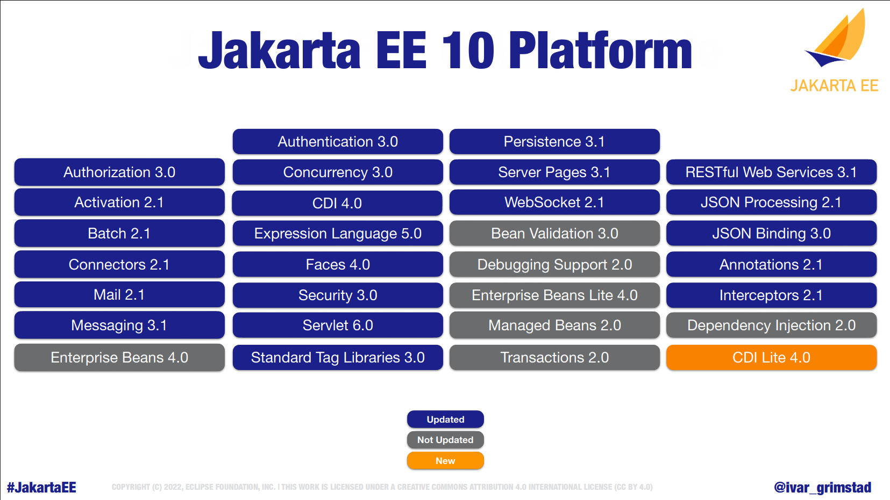
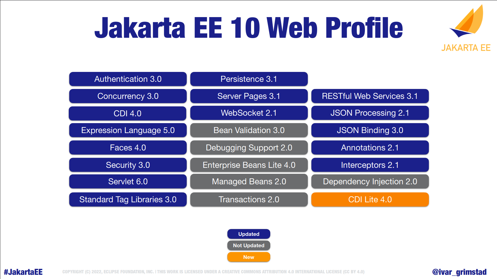
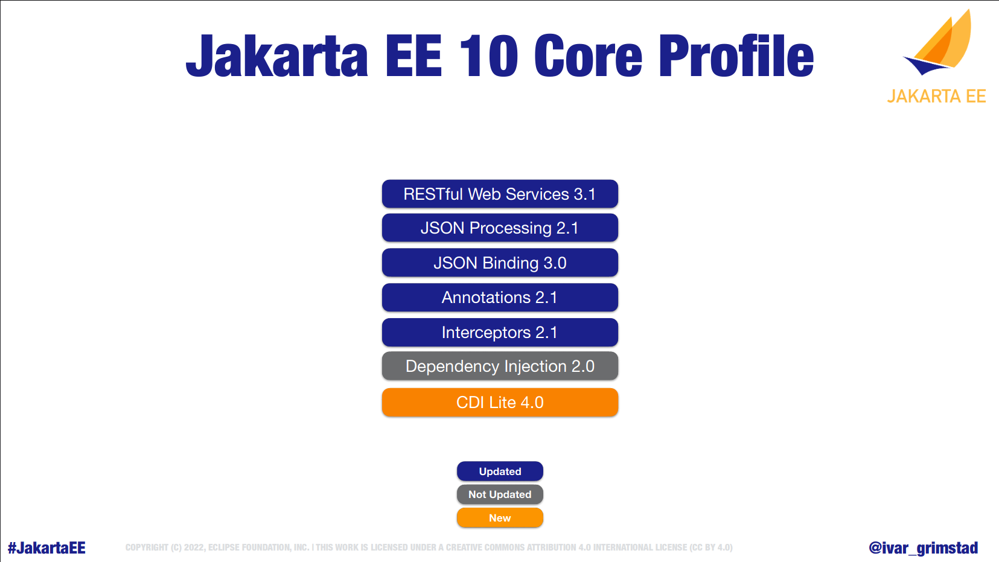

# Jakarta EE 10 アップデート
2022/06/24
Takayuki Maruyama

---

# Jakarta EE ?
- `Java EE`の後継となる、エンタープライズJavaアプリケーションフレームワーク仕様
- Oracleが主導していたJava EEから、コミュニティ主導のJakarta EEへ
	- Eclipse Foundation傘下のプロジェクトになった
- 参照実装 (Reference Implementation) → 互換実装 (Compatible Implementation)
- Jakarta EE 8: 権利関係を整理して行った最初のリリース
	- 中身はJava EE 8と同じ
- Jakarta EE 9: `javax` -> `jakarta`名前空間への移行
	- Jakarta EE 9.1: Java SE 11をターゲットとしたリリース
- Jakarta EE 10: Jakarta EE 初めての機能向上リリース

---

<!-- footer: https://speakerdeck.com/ivargrimstad/jakarta-ee-10-feature-by-feature?slide=6 より引用 -->


---

<!-- footer: https://speakerdeck.com/ivargrimstad/jakarta-ee-10-feature-by-feature?slide=7 より引用 -->


---

<!-- footer: https://speakerdeck.com/ivargrimstad/jakarta-ee-10-feature-by-feature?slide=8 より引用 -->


---

<!-- footer: This work is licensed under a [Creative Commons Attribution-ShareAlike 4.0 International License](http://creativecommons.org/licenses/by-sa/4.0/). -->

# Jakarta EE 10 の主な変更内容
<!-- ここからは、Jakarta EE 10の変更点について詳しく説明していきます -->

---

# Java SE バージョン
- API ソース: Java 11
- API バイナリ (jar): Java 11
- TCK (Technology Compatibility Kit) 実行: Java 11+
	- Compatible Implementationが独自に、Java 17での実行もサポート可能
##
- Jakarta EE 10は、Java SE 11が最低要件
	- JPMS (Java Platform Module System, a.k.a. Project Jigsaw) にも対応
- 使用するAPサーバーがサポートしていれば、Java 17の機能をフルに使ったアプリ開発が可能

---

# 新しいプロファイル: Core Profile
- マイクロサービス、ネイティブコンパイル (GraalVM) 等、小さなランタイムでの実行に適した一連の仕様を含むプロファイル

---

# Specs without feature update
- APIや機能に変更はないが、JPMS (Java Platform Module System)サポートのために`module-info.java`が追加された
	- Enterprise Beans 4.0.1
	- Bean Validation 3.0.1
	- Transactions 2.0.1
	- Dependency Injection 2.0.1
- 変更なし
	- Debugging Support 2.0
	- Managed Beans 2.0

---

# Specs with feature update
22個の仕様がメジャー or マイナーバージョンアップしている。
(API非互換があればメジャーバージョンが上がっている、ハズ)

---

## [Authorization ~~3.0~~ 2.1](https://jakarta.ee/specifications/authorization/2.1)
- APIの追加・互換性を損なわない変更のみ。
	- [Issue#52](https://github.com/jakartaee/authorization/issues/52): Add methods to PolicyConfiguation to read permissions
	- [Issue#53](https://github.com/jakartaee/authorization/issues/53): Add getPolicyConfiguration methods without state requirement
	- [Issue#105](https://github.com/jakartaee/authorization/issues/105): Generic return value for getContext

---

## [Activation 2.1](https://jakarta.ee/specifications/activation/2.1)
- 2.0以前は、APIと実装を1つにまとめたjarしか提供していなかったが、他のJakarta EE仕様と同様に、API jarを単独で配布するようなった。
- CI: Eclipse Angus - Activation  
https://github.com/eclipse-ee4j/angus-activation

<!-- Jakarta Mail (旧JavaMail) がMIME (Multipurpose Internet Mail Extension) でASCIIテキスト以外を扱う際に利用する -->

---

## [Batch 2.1](https://jakarta.ee/specifications/batch/2.1)
- Contexts and Dependency Injection (CDI) との統合
	- Batch関連クラスがInject可能に
	- プロパティ値をInjectする`@BatchProperty`で、primitive wrapper typeの値を注入可能に

---

## [Connectors 2.1](https://jakarta.ee/specifications/connectors/2.1)
- Bug fixとDocument clean upのみ。
	- Bug fix: `java.util.Map`を実装したクラスでジェネリクスを使用、等

---

## [Mail 2.1](https://jakarta.ee/specifications/mail/2.1)
- APIとimplの分離
	- CI: Eclipse Angus Mail (https://jakarta.ee/eclipse-ee4j/angus-mail)
- `jakarta.mail.util.StreamProvider`インタフェースを追加
	- InputStream, OutputStreamといった入出力Streamを生成する処理を提供する
		- 例: BASE64エンコードされた入力をデコードするInputStream
		- API classes内で使用する入出力Stream生成をimplに任せる形に

---

## [Messaging 3.1](https://jakarta.ee/specifications/messaging/3.1)
- `@JMSConnectionFactoryDefinition`, `@JMSDestinationDefinition`が`@Repeatable`に

---

## [Authentication 3.0](https://jakarta.ee/specifications/authentication/3.0)
- `SecurityManager`を使用するAPIが`@Deprecated(forRemoval=true)`に
	- Java SE 17での変更に追従
- ジェネリクスの導入
- 認証処理中にCDI/Faces contextsがアクティブかどうか判定する手段を追加
- 認証方式(`ServerAuthModule`)の追加を容易にするAPI
	```java
	// https://arjan-tijms.omnifaces.org/2022/04/whats-new-in-jakarta-security-3.html より
	// in ServletContextInitializer
	@Override
	public void contextInitialized(ServletContextEvent sce) {
	    AuthConfigFactory.getFactory()
	        .registerServerAuthModule(
	            new TestServerAuthModule(),
	            sce.getServletContext()
	        );
	}
	```

---

## [Concurrency 3.0](https://jakarta.ee/specifications/concurrency/3.0)
- Parallel Streamで使うForkJoinThreadを、Concurrency管理下のThreadFactory(`ManagedThreadFactory`)を使って生成できるように
	- JVM全体で共通のスレッドプールではなく、APサーバーで定義したスレッドプールを利用できる
	- 例 (Javadocより)
		```java
		ManagedThreadFactory threadFactory = InitialContext.doLookup("java:comp/DefaultManagedThreadFactory");
		ForkJoinPool pool = new ForkJoinPool(Runtime.getRuntime().availableProcessors(), threadFactory, null, false);
		ForkJoinTask<Double> totals= pool.submit(() -> orders
		    .parallelStream()
		    .map(order -> {
		        if (order.total == 0.0) {
		            // lookups require application component namespace:
		            try (Connection con = 
		                    ((DataSource)InitialContext.doLookup("java:comp/env/jdbc/ds1"))
		                        .getConnection()) {
		                order.total = ...
		            } catch (NamingException | SQLException x) {
		                throw new CompletionException(x);
		            }
		        }
		        return order.total;
		    })
		    .reduce(0.0, Double::sum));
		System.out.println("Sum is: " + totals.join()); pool.shutdown();
		```
	<!-- 要は、ForkJoinPool#submitに、parallelStreamを使う処理を渡してやれば、JVMで1つだけ存在するデフォルトのForkJoinPoolではなく、渡されたForkJoinPoolでスレッドを生成してくれる、という話。Java SE環境でも同じ方法で自前のForkJoinPoolを利用できる。 -->

---

## [Context Dependency Injection 4.0](https://jakarta.ee/specifications/cdi/4.0)
- CDI Lite for Core Profile
	- フル仕様との差分
		- `@SessionScoped`, `@ConversationScoped`, `@Decorator`を除く
		- bean-discovery-modeが`none`または`annotated`のみ
		<!-- bean-discovery-mode: allを除くことで、アノテーションを解析すればコンパイル時にどのクラスを利用するか決まるため、ネイティブコンパイルしやすくなる (どのクラスをネイティブコードに落とし込めばよいかわかる) -->
- 非推奨APIの削除
	- APIに`@Deprecated`は指定されていなかったが、仕様として非推奨だったものが削除されている(`@New`等)
		- CDI 1.1で非推奨とされていた

---

## [Expression Language 5.0](https://jakarta.ee/specifications/expression-language/5.0)
- ジェネリクスの追加
- 式中のラムダ式を関数インタフェースとして認識できるように
	- メソッド`foo(Predicate<T>)`の呼び出しを`${obj.foo(o -> true)}`と書ける
	- 4.0以前は`IllegalArgumentException`
- その他(主にJakarta Facesに必要な)改善

---

## [Faces 4.0](https://jakarta.ee/specifications/faces/4.0)
- 主な変更点
	- FaceletをJava APIから作成できるように
	- 拡張子(`.xhtml`)を省略したURLを利用可能にするオプション`jakarta.faces.AUTOMATIC_EXTENSIONLESS_MAPPING`追加
		- web.xmlの`<context-param>`で指定する。デフォルトは`false`
	- `@ClientWindowScoped`追加
		- ブラウザウィンドウ・タブ単位のスコープ
		<!-- ClientWindowScoped: ViewScopedより広く、SessionScopedより狭いスコープ -->

---

## [Faces 4.0](https://jakarta.ee/specifications/faces/4.0)
- 主な破壊的変更
	- `jsf`→`faces`
	- `http://xmlns.jcp.org/jsf/` (URL)  → `jakarta.faces.` (URN)
		- 例: `jakarta.faces.core`, `jakarta.faces.composite`
	- JSPビューのサポートを削除
	- `@ManagedBeans` (CDIを使わないバッキングビーン) の削除
	- `@Deprecated`なAPIの削除 (`ValueBinding`, `MethodBinding`等)

---

## [Security 3.0](https://jakarta.ee/specifications/security/3.0)
- OpenID Connect認証をサポート
- 当初予定していた改良の大半が次バージョンに先送りされている
	- DIGEST認証、クライアント証明書認証、etc...

---

## [Servlet 6.0](https://jakarta.ee/specifications/servlet/6.0)
- Cookieが準拠するRFCが RFC 2019 から RFC 6265 に変更
	- コメント、バージョンが設定不可に (アクセッサは残っているが`@Deprecated(forRemoval=true)`であり、呼んでも何も起こらない)
	- 任意の属性を`Cookie#setAttribute(String, String)`で設定可能に
		- セキュリティの関係で属性が追加された時、APIの修正を待たずに対処できる 
- 現在のリクエスト・ネットワーク接続を一意に識別するIDを取得できるAPIが追加
	- `ServletConnection#getConnectionId`, `#getRequestId`
	- ログ出力用途を想定
	- 生成される文字列の形式は実装依存
- Servlet 5.0までに非推奨となっていたクラス・メソッドを削除

---

## [Standard Tag Libraries 3.0](https://jakarta.ee/specifications/tags/3.0)
- Rename URI
	- `http://xmlns.jcp.org/jsp/jstl/` → `jakarta.tags.`
		- 例: `jakarta.tags.core`, `jakarta.tags.fmt`

---

## [Persistence 3.1](https://jakarta.ee/specifications/persistence/3.1)
- `EntityManagerFactory`, `EntityManager`に`AutoCloseable`インタフェースを実装
	- コンテナにインスタンスを管理させているなら問題ないが、自前で生成している場合はResource leakの警告が出るようになるため注意
- IDやプロパティの型として`java.util.UUID`をサポート
- `CEILING`, `EXP`, `FLOOR`, `LN`, `POWER`, `ROUND`, `SIGN`関数をJakarta Persistence QL, Criteria APIの双方でサポート
- `EXTRACT`関数をJakarta Persistence QLでサポート
<!-- EXTRACT: 日付時刻の特定のフィールドを取り出すことができる -->

---

## [Server Pages 3.1](https://jakarta.ee/specifications/pages/3.1)
- Servlet 6.0で`SingleThreadModel`が削除されたことに伴い、ページディレクティブの属性`isThreadSafe`が非推奨に
- `<jsp:plugin>`, `<jsp:action>`, `<jsp:fallback>`が非推奨、記述しても無視するように
	- Javaアプレットと組み合わせて使うタグ(らしい)。現時点でJavaアプレットはどのブラウザでも動作しないため不要になった
- EL式に未定義の識別子が含まれる場合に例外を発生させるオプションが追加

---

## [WebSocket 2.1](https://jakarta.ee/specifications/websocket/2.1)
- 任意のタイミングでHTTPからWebSocketに切り替えるAPIを追加
- デフォルト設定の`ServerEndpointConfig.Configurator`を取得するAPIを追加
- WebSocketクライアントのSSL/TLS設定APIを追加

---

## [RESTful Web Services 3.1](https://jakarta.ee/specifications/restful-ws/3.1)
- Java SE Bootstrap API
	- CDI SEとのインテグレーションは 4.0 で対応予定
- Multipartサポート (`multipart/form-data`)
- `ContextResolver<Jsonb>`をアプリケーション側で実装していればそちらを優先するように
- `@Context`を非推奨としてCDIを使用するように

---

## [RESTful Web Services 3.1](https://jakarta.ee/specifications/restful-ws/3.1)
### Java SE Bootstrap API
```java
class ApiApplication extends Application {}

public class Main {
  public static void main(String... args) {
    SeBootstrap.start(new ApiApplication(), SeBootstrap.Configuration.builder().build());
  }
}
```

---

## [RESTful Web Services 3.1](https://jakarta.ee/specifications/restful-ws/3.1)
### Demo / Java SE Bootstrap API
- Web APIを提供するアプリケーション(WAR)を、Java SE環境で起動する形に書き換える
- Source: https://github.com/maruTA-bis5/slide-sources/blob/master/202206-jakarta-ee-10-overview/demo/cdi-rest-se-bootstrap

---

## [JSON Processing 2.1](https://jakarta.ee/specifications/jsonp/2.1)
- APIと実装のプロジェクトを分離
	- 実装: Eclipse Parsson (https://github.com/eclipse-ee4j/parsson)
- プリミティブ値から`JsonValue`を得るAPI `Json.createValue`
- パース中の状態を取得する `JsonParser#currentEvent()`
- プロパティ名(キー)が重複した場合の挙動を指定可能に (先勝ち/後勝ち/禁止(`JsonException`))

---

## [JSON Binding 3.0](https://jakarta.ee/specifications/jsonb/3.0)
- `null`値を`JsonValue.NULL`としてデシリアライズする
	- `{"property": null}`のようにプロパティは存在するが値が`null`のケース
	- プロパティが存在しないケースは単に`null`となる
- `@JsonbProperty.nillable()`が非推奨に。代わりに`@JsonbNillable`を使う
- ポリモーフィックな[de]serialize
	- JSONに設定されたキーと`@JsonbPolymorphicType`で[de]serialize対象クラスを判定する
	- https://jakarta.ee/specifications/jsonb/3.0/jakarta-jsonb-spec-3.0.html#polymorphic-types

---

## [Annotations 2.1](https://jakarta.ee/specifications/annotations/2.1)
- `@Priority`をクラス宣言・引数だけでなく、あらゆる場所で使えるように
- `@Nullable`, `@NotNull`の追加
	- `javax.annotations.Nullable`, `javax.annotations.NotNull`をAnnotations仕様の一部として追加

---

## [Interceptors 2.1](https://jakarta.ee/specifications/interceptors/2.1)
- Updated dependencies for Jakarta EE 10
- Add JPMS module-info

---

# Jakarta EE 10 進捗状況
※2022/06/18時点
- 個別のSpecは全てリリースレビュー完了 :white_check_mark:
- Core Profile: WildFly 27.0.0.Alpha1をCIとしてリリースレビュー準備中 :clock2:
	- https://github.com/jakartaee/specifications/pull/495
- Web Profile, Platform: CI(予定)のGlassFishでTCKがfailing :x:
	- Web Profile: https://github.com/jakartaee/specifications/pull/497
	- Platform spec: https://github.com/jakartaee/specifications/pull/498

---

# その他仕様の紹介

---

# [Jakarta MVC](https://jakarta.ee/specifications/mvc/)
- アクション指向のWebアプリケーションフレームワーク
	- like Spring MVC, Struts, Ruby on Rails
	- Facesはコンポーネント指向
- パーフェクトJava EEに掲載されたが、Java EE 8のスコープ外になってしまった悲しい過去を持つ
- CI: Eclipse Krazo (https://github.com/eclipse-ee4j/krazo)
- Jakarta EE Platformには含まれないが、単独でリリース済のため依存関係を追加すれば使うことは可能

---

# [Jakarta MVC](https://jakarta.ee/specifications/mvc/)
- アクション指向のWebアプリケーションフレームワーク
	- like Spring MVC, Struts, Ruby on Rails
	- Facesはコンポーネント指向
- パーフェクトJava EEに掲載されたが、Java EE 8のスコープ外になってしまった悲しい過去を持つ
- CI: Eclipse Krazo (https://github.com/eclipse-ee4j/krazo)
- Jakarta EE Platformには含まれないが、単独でリリース済のため依存関係を追加すれば使うことは可能
---

# [Jakarta NoSQL](https://projects.eclipse.org/projects/ee4j.nosql)
- 異なるNoSQLデータベース(Redis, Cassandra, Couchbase, etc...)にアクセスするための統一されたAPIを定義する
- CI予定: Eclipse JNoSQL (https://github.com/eclipse/jnosql)

---

# Jakarta Data
- Persistence, NoSQLを統一的に扱うためのアノテーション・インタフェースを提供する
- まだ議論が始まったばかり

---

# [Jakarta RPC](https://jakarta.ee/specifications/rpc)
- gRPCのサービス・クライアントをJavaで容易に実装出来るようにする
- マイクロサービス間の連携に利用できそう

---

# [Jakarta Config](https://projects.eclipse.org/projects/ee4j.jakartaconfig)
- 環境別の設定を、propertiesファイルや環境変数などアプリケーション外部から注入可能にする
- Eclipse MicroProfile Configに類似 (MP Configをベースにしている?)
- 当初はJakarta EE 10に含まれる予定だったが遅延している

```java
@Inject
@ConfigSource("property.name") // CDIのQualifier
String property;
```

---

# まとめ
- Jakarta EE 10は、Jakarta EEとして初めての機能向上リリース
	- 多くの仕様でfeature updateされている
	- 新しいバージョンのJava SE環境で開発・動作する事も可能
- 新しい仕様も複数提案されており、今後に注目したい

---

# 参考
- https://jakarta.ee
- Jakarta EE 10 - Feature by Feature
https://speakerdeck.com/ivargrimstad/jakarta-ee-10-feature-by-feature
