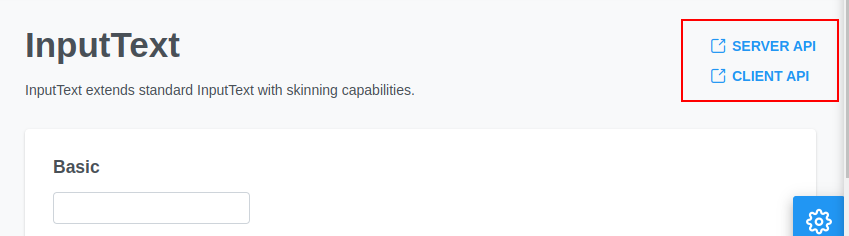

 
# Inside PrimeFaces
2023/06/16
Takayuki Maruyama

<!--
# PrimeFaces Inside
PrimeFacesの処理の追いかけ方やカスタマイズ方法、コミュニティと繋がり方を紹介する。
想定ターゲット　PrimeFacesを利用する開発者、Jakarta Facesの基本的な知識(ライフサイクル、UIComponent)を有する。(完全な理解は要求せず、適宜補足する)
-->

---

## Agenda
- PrimeFacesについて
- PrimeFacesの主な機能
- 処理の追い方
- よくあるトラブルとデバッグ方法
- 問題報告

---

<!--header: PrimeFacesについて -->
## PrimeFacesについて

---

## PrimeFacesとは
- Jakarta Faces (旧Java ServerFaces, JSF) で利用可能なUIコンポーネントライブラリ
- トルコ:tr:のPrimeTek Informatics社がコミュニティと協調して開発している
(コミュニティからの貢献が大部分を占める。)
- PrimeTek社は、商用サポートやプレミアムテーマ、周辺ツールなどを提供する

---

### ライセンス体系
- PrimeFaces Community
コミュニティが提供するバージョン。MIT Licenseで利用可能なOSS
- PrimeFaces Elite
PrimeTek社による商用サポートライセンス。プレミアムテーマの利用や、Community版では提供されないパッチバージョン(`12.0.x`)のダウンロードが可能
- PrimeFaces PRO
PrimeTek社による商用サポートライセンス。Eliteに加えて、専用フォーラムを通じたバグ報告や機能要望が可能

詳しくは: https://www.primefaces.org/showcase/support.xhtml

---

### PrimeFaces ファミリー (1/2)
- 
React向けのUIコンポーネントライブラリ
- 
Angular向けのUIコンポーネントライブラリ
- 
Vue.js向けのUIコンポーネントライブラリ

<!-- PrimeFacesと同様のコンポーネントライブラリが、React, Angular, Vuw.js向けにも提供されている。いずれもOSS -->

---

### PrimeFaces ファミリー (2/2)
- 
Flexboxを活用したCSSレイアウトライブラリ (OSS)
- 
PrimeFaces, PrimeNG, PrimeReact, PrimeVueで共通で利用されるアイコンフォント (OSS)
- 
ありがちなレイアウトを実現できるコードスニペット (一部有償)
- Theme Designer
テーマをカスタマイズするためのツール (要Eliteライセンス)

<!-- コンポーネントライブラリ以外では、これらのツールが提供されている -->

---

<!-- header: 主な機能 -->

## PrimeFacesの主な機能
- Dialog Framework 
- Client Side Validation
- リッチUIコンポーネント

<!-- 主な機能としてこの3つを紹介する。 -->
---

### Dialog Framework
- 独立した画面をダイアログとして開くことができる仕組み
- ダイアログを開く元画面とは独立したView Scope, コンポーネントツリーを持つ
    - 通常のダイアログ(`<p:dialog>`)は同じ画面内の1コンポーネントとして振る舞う
- Render Response Phase中に例外が発生すると、例外が発生したコンポーネントより上だけが表示される場合がある

<!-- 通常のダイアログは同じ画面内のコンポーネントとして振る舞うことから、画面と同じView Scopeになる -->
<!-- Render Response Phase: 例えば上側に検索条件、下側に検索結果を表示する検索ダイアログがあるときに、検索条件のコンポーネントが例外を発生させた場合、上から順に例外が発生しなかったコンポーネントだけ表示され、それ移行の検索結果や検索結果が表示されない、という状況が発生する場合がある。このとき、アプリケーションサーバーのログには例外が記録されているので、そちらを確認してデバッグすることになる -->
---

### Client Side Validation (CSV)
- ボタンクリックなどのアクション実行時に、クライアント(ブラウザ)側で入力値のバリデーションを実行できる機能
    - サーバーサイドのバリデーションと同様に、Converterで入力値を変換→Validatorで検証、をクライアント側で実行できる
- PrimeFacesには、Jakarta Faces標準のConverter/Validatorに対応するCSV実装がバンドルされている
→有効化してやれば、特別な実装をせずともCSVを利用可能

<!-- Converter: ブラウザでの入力は基本的に全て文字列なので、文字列から数値・日付といった型の変換を行う -->

---

### Client Side Validation (CSV)
- 自前の`Converter`をCSVに対応させる方法
    - [Server Side] `Converter`実装に`ClientConverter`インタフェースを実装する
    - [Client Side] JavaScript: `PrimeFaces.converter['自前ConverterのID']`に  
    変換処理を実装する
        ```javascript
        PrimeFaces.converter['converter.Date'] = {
            MESSAGE_ID: 'your.own.converter.MESSAGE',
            regex: /^\d{4}-\d{2}-\d{2}$/,

            convert: function(element, value) => {
                const vc = PrimeFaces.validation.ValidationContext;

                if (!this.regex.test(value)) {
                    throw vc.getMessage(this.MESSAGE_ID, vc.getLabel(element));
                }
                return new Date(value);
            }
        };
        ```

---

### Client Side Validation (CSV)
- 自前の`Validator`をCSVに対応させる方法
    - [Server Side] `Validator`実装に`ClientValidator`インタフェースを実装する
    - [Client Side] JavaScript: `PrimeFaces.validator['自前ValidatorのID']`に
    バリデーションの実装を追加する
        ```javascript
        PrimeFaces.validator['validator.PostalCode'] = {
            MESSAGE_ID: 'your.own.validator.MESSAGE',
            regex: /^\d{3}-\d{4}$/,

            validate: function(element, value) => {
                const vc = PrimeFaces.validation.ValidationContext;
                if (!this.regex.text(value)) {
                    throw vc.getMessage(this.MESSAGE_ID, vc.getLabel(element)):
                }
            }
        };
        ```

---

<!-- header: UIコンポーネント-->
### UIコンポーネント
UIコンポーネントは、主に以下の要素で構成されている。
- FooBarBase (例: `DatePickerBase`)
コンポーネントの親クラス  
タグの属性に対応するプロパティが定義されている
- FooBar (例: `DatePicker`, `class DatePicker extends DatePickerBase`)
コンポーネント本体のクラス
コンポーネントのサーバサイドの処理が実装されている
- FooBarRenderer (例: `DatePickerRenderer`)
コンポーネントのRenderer(`javax.faces.renderer.Renderer`のサブクラス)  
リクエストのデコードと、レスポンスのエンコード(HTML/JSの生成)を担う
- (JavaScript) PrimeFaces.widget.FooBar (例: `PrimeFaces.widget.DatePicker`)
コンポーネントのクライアントサイドの処理

---

#### コンポーネントごとのドキュメント
1. Faceletsタグ属性と詳細な説明: User Guide (https://primefaces.github.io/primefaces/)
2. JavaScript API: https://primefaces.github.io/primefaces/jsdocs/
3. サンプルコードと実行例: Showcase (https://primefaces.org/showcase)
    - 各コンポーネントのページから[1.], [2.]のドキュメントに遷移可能
        1. Server API -> User Guide
        2. Client API -> JSDoc
        
<!--
showcaseの該当コンポーネントのページにあるServer API, Client APIリンクから閲覧可能。Server APIがJakarta Facesのタグだったりコンポーネントクラスに関する説明、Client APIがJavaScriptの説明になっている。
-->

---

<!-- header: 処理の追い方 -->

## 処理の追い方

---

### リクエストパラメータからコンポーネントへの値設定を確認する
※`Apply Request Values`フェーズ
#### Jakarta Faces
- 各コンポーネントの`processDecode()`が呼ばれる
    - リクエストパラメータから値を取り出して、コンポーネントに保持される(`submittedValue`)
<!--
Apply Request Values Phaseにて、各コンポーネントの`processDecode()`が呼ばれて、リクエストパラメータの値をコンポーネント内の`submittedValue`という属性に保持する
-->
- `Renderer`が設定されている場合: `Renderer#decode`に処理が移譲される。
<!--コンポーネントにRendererが設定されている場合、Renderer#decodeに移譲される -->
#### PrimeFaces
- 各コンポーネントに`CoreRenderer`を継承した`Renderer`が設定されている
<!-- PrimeFacesの各コンポーネントには`Renderer`が設定されているため、その`Renderer`の`decode()`メソッドで処理される。 -->

---

### レンダリングされるレスポンスの内容を確認する
※`Render Response`フェーズ
#### Jakarta Faces
- 各コンポーネントの`encodeAll()`から`encodeBegin()`, `encodeEnd()`が呼ばれる
<!--
Render Response Phaseにて、各コンポーネントの`encodeAll` -> `encodeBegin()` -> `encodeEnd()`メソッドが呼ばれて、レスポンスが生成される。  
-->
- `Renderer`が設定されている場合: `encodeBegin()`, `encodeEnd()`の処理は`Renderer`に移譲される
<!--
コンポーネントに`Renderer`が設定されていれば、`Renderer`の`#encodeBegin()`, `encodeEnd()`に処理が移譲される。
-->
#### PrimeFaces
- 各コンポーネントに`CoreRenderer`を継承した`Renderer`が設定されている
    - `encodeBegin()`は空、`encodeEnd()`に必要な処理が実装されている
    - `encodeEnd()`: `encodeMarkup()`, `encodeScript()`を呼ぶ
        - `encodeMarkup()`: HTMLを生成する
        - `encodeScript()`: JavaScriptを生成する

<!-- 前のページで説明したとおり、PrimeFacesの各コンポーネントには`Renderer`が設定されているため、その`Renderer`の`encodeBegin`, `encodeEnd``メソッドに移譲される -->
<!--
`CoreRenderer`は、`encodeBegin()`は空実装で、`encodeEnd()`にレスポンス生成の処理が実装されている。
`encodeEnd()`からは、HTMLを生成する`encodeMarkup()`、JavaScriptを生成する`encodeScript()`が呼ばれるようになっている。
`HTMLの生成結果を確認するなら`encodeMarkup()`, JavaScriptの生成結果を確認するなら`encodeScript()`の実装を確認することになる -->

---

### クライアント側処理を確認したい
- `primefaces-${version}.jar`に格納されているjsはminify(圧縮)されている
→まずはminify前のソースを確認するのが手っ取り早い
    - minify前はコンポーネントごとにファイルが別れているため読みやすい
<!--
Jarに格納されているjsはminify(圧縮)されている。どういうことかというと、変数名が短縮されたり、改行・空白が除去された状態であり、そのまま読むのは難しい。
→まずは元のjsファイルをGitHubで確認するのが手っ取り早い。
minify後はすべてのコンポーネントが1ファイルに纏められているが、minify前はコンポーネントごとにファイルが分かれている為探しやすい。
-->

#### 探し方 (:tv: デモで実演)
- GitHubのリポジトリ (https://github.com/primefaces/primefaces)にアクセスし、使用しているバージョンのタグに切り替える
- `primefaces/src/main/resources/META-INF/resources/primefaces`以下を探す
    - 例: DataTableのソースは`datatable/datatable.js`
- ブラウザの開発者ツール(F12)で`components.js`を開き、整形する(`{}`ボタン)
- `PrimeFaces.widget.コンポーネント名 = `を検索して読む
<!--
使用しているバージョンのタグに切り替えてから、primefaces/src/main/resources/META-INF/resources/primefaces/ 以下を探す。
机上デバッグで良ければここまで。動作させながらデバッグする場合、ブラウザの開発者ツールでcomponents.jsを開いて難読化解除してから、コンポーネント名で検索し、それっぽいコードを探す。minifyで変数名や関数名が短縮されるが、文字列リテラルや制御構造は維持されるので、それらを手がかりにする。
-->

---

<!-- header: よくあるトラブルとデバッグ方法 -->
## よくあるトラブルとデバッグ方法

<!-- よくあるトラブルとデバッグの方法について、2つ紹介する -->

---

### CommandButtonをクリックしても何も起こらない
- 原因
    - `<p:ajaxExceptionHandler>`が無いと、Ajax操作時に例外が発生してもエラーは通知されない
    - エラーメッセージの表示先(`<p:message>`, `<p:messages>`)が再描画の対象(`update`属性で指定)でなければ、バリデーションエラーが表示されない
- 対応方法: Ajax通信のレスポンスボディを見る
    - 例外発生: それっぽいメッセージが格納されている
    - バリデーションエラー: レスポンスボディの末尾近くに`validationFailed`という文字列がある    

---

### 例外が発生してしまった
- Jakarta Facesの処理で例外が発生すると、長いスタックトレースがログ出力される
- EL式の処理中に例外が発生していれば、必ず原因箇所が出力されているため、それを探す
    - :tv: デモで実演
<!-- EL式以外だったら普通のJavaの処理で落ちているのだと思うので、いつもどおりにスタックトレースを読んで原因箇所を確認する -->

<!--
#### デモシナリオ
- 前提
    - 例外は`javax.el.PropertyNotFoundException: Target unreachable, 'null' returned`
    - WildFly 26.1.3, Jakarta EE 8, PrimeFaces 12.0.0, wildfly-jar-maven-plugin
- 確認ポイント
    - Ajaxの確認ボタンはなんの反応もしないが例外がログに出力されていること
    - 非Ajaxの確認ボタンはエラーページに遷移すること
    - スタックトレースを見ると発生箇所が記載されること
        - 末尾の`Caused by`には記載されないため先頭を確認する必要があること
-->

---

<!-- header: 問題報告 -->
## 問題報告

---

## 問題報告
PrimeFacesはOSS
不具合と思われる動作があれば報告することでコミュニティに還元してほしい
(一時的に回避する目的でパッチを書くなら、そのパッチを提供して将来的にパッチが不要になるように)
<!-- これはPrimeFacesに限らず、オープンソースを利用する上で重要な考え方。OSSをただ利用するだけではなくて、還元することでコミュニティの維持・拡大につながる -->
手順としては、大まかに次の通り。

---

### 問題の報告手順
1. 素のPrimeFaceaで不具合が発生することを確認できるコードを用意する
    - PrimeFaces Showcaseで問題が発生するならその内容を示せば良い
        - 最新のmasterからShowcaseをビルドし、再現するか確認できれば尚良し
            - 公開されているShowcaseは常に最新ではなさそう
    - もしくは、https://github.com/primefaces/primefaces-test をコピーするなどして、これを元に再現するための最小限のプログラムを作成する。
2. GitHubにIssueを作成する (https://github.com/primefaces/primefaces/issues/new/choose)
    - `Defect report`テンプレートを使用する
3. コミュニティメンバーからの質問や検証依頼があれば対応する
4. 可能であれば、修正パッチをPull Requestで提供する

---

<!-- header: リリースサイクル -->
## リリースサイクル
### Community
- 半年に1回リリースする方針
    - PrimeFaces 12まではおおよそ1年毎にリリース
    - PrimeFaces 13のRC(リリース候補)版が2023/05にリリースされている
<!--月が決まっているわけではないようだが、半年に1回リリースする方針とされている。-->

### Elite/PRO
- Communityのリリースをベースとし、パッチバージョンが随時リリースされる
    - PrimeTek社が管理するプライベートなリポジトリから行われる
    - 一部の修正や改善が、Communityに先駆けてリリースされる
    - どのIssueが対象となっているかは、ラベルで判別可能。
(例: 12.0.4に取り込まれているIssueには`12.0.4`ラベルが設定されている)

---

<!-- header: 参考情報 -->
## 参考情報
- GitHub
https://github.com/primefaces/primefaces
- Showcase
https://www.primefaces.org/showcase
- ドキュメント
https://primefaces.github.io/primefaces/  
https://primefaces.github.io/primefaces/jsdocs/
- Discord
https://discord.gg/gzKFYnpmCY
- フォーラム
https://forum.primefaces.org/
