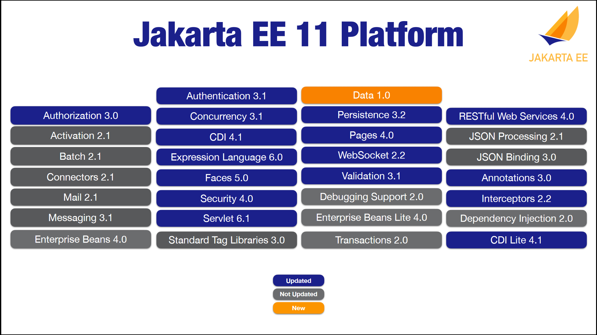

# Jakarta EE 11 キャッチアップ

2023-11-11
JJUG CCC 2023 Fall
#jjug_ccc #jjug_ccc_a2

株式会社ビーブレイクシステムズ
丸山 貴之


---

## whoami

- 丸山 貴之
- 株式会社ビーブレイクシステムズ 開発部 シニアSE
- 業務: 基幹業務パッケージの開発・導入・保守、新卒技術研修、自社OSSメンテナ
- ブログ: https://tech.bis5.net
- X: [@maruTA_bis5](https://x.com/maruTA_bis5)
- GitHub: [@maruTA-bis5](https://github.com/maruTA-bis5)
- よく使うコンポーネント: Jakarta Faces (JSF), CDI, Bean Validation, JMS

---

## Disclaimer 
本セッションで紹介する内容は2023/11時点での予定であり、Jakarta EE 11が正式にリリースされるまでに変更となる可能性があります

---

## Agenda
- Jakarta EEとは
- Jakarta EE 11
    - 主な変更点
    - コンポーネント毎の変更
- スケジュール

---

## Jakarta EEとは

https://jakarta.ee

- クラウドネイティブなエンタープライズアプリケーションをJavaで開発するためのフレームワーク
- 以前は`Java EE`として、Oracle社が主導して仕様を策定していたが、
現在はEclipse Foundation傘下のプロジェクトとして活動
- Jakarta EEプロジェクトは仕様を提供し、仕様を満たすアプリケーションサーバーがベンダーによって提供される
(アプリケーションサーバーの例: Eclipe GlassFish, WildFly, WebSphere Liberty)

---

### Profile
- Platform: クラウドネイティブJavaアプリケーションを実現するためのコンポーネントの集合
- Web Profile: Webアプリケーション開発に必要なコンポーネントに限定したサブセット
- Core Profile: マイクロサービスやAOT(ahead-of-time)コンパイル(GraalVM)で利用できるコンポーネントに限定したサブセット

---

## Jakarta EE 11<br>主な変更点

---

### 全般 
- API Source and Target Level: Java SE 21
- TCK Source Level: Java SE 21
→recordやVirtual Threadsといった新機能
- New Component: Jakarta Data
- `@jakarta.annotation.ManagedBean`の削除
- Remove all usage of SecurityManager
    - Java 17 (JEP 411)で`@Deprecated(forRemoval=true)`
- Remove all optional specifications
    - Enterprise Beans 2.x API, Enterprise Web Services, SOAP with Attachments, XML Web Services, XML Binding

---

<style scoped>
    section { 
        font-size: 16px;
        padding: 100px;
    }
    img {
        border: 1px solid black;
    }
</style>


https://speakerdeck.com/ivargrimstad/prepare-for-jakarta-ee-11-af58e464-eeb9-49d7-a7ae-8c39749455f3?slide=7

---

## Jakarta EE 11<br>コンポーネント毎の変更

---

### Jakarta Data 1.0
https://jakarta.ee/specifications/data/1.0/

- データアクセスが容易になるAPIを提供する
    - Spring DataのRepositoryのようなイメージ
- 既存のデータアクセス(Jakarta Persistence, Jakarta NoSQL, etc)を置き換えるものではなく、補うためのAPIを提供することが目的

---

### Jakarta Data 1.0
実装例
```java
@Repository
public interface Garage extends CrudRepository<Car, Long> {

  List<Car> findByType(CarType type);

  Optional<Car> findByName(String name);

}
...

@Inject
Garage garage;
...
Car ferrari = Car.id(10L).name("Ferrari").type(CarType.SPORT);
garage.save(ferrari);
```

---

### Jakarta CDI 4.1
https://jakarta.ee/specifications/cdi/4.1/

- Method Invokers
    - 例: `@HeaderParam`引数の値をリクエストヘッダーから取り出してメソッドを呼ぶ、がCDIで実現可能になる
- `@Produces`で`@Priority`をサポート
- BeanManagerのExpression Language関連APIを独立したartifactに分離
    - `ELAwareBeanManager`(extends BeanManager)
    - `getELResolver()`, `wrapExpressionFactory(ExpressionFactory)`は非推奨、削除予定

---

### Jakarta Concurrency 3.1
https://jakarta.ee/specifications/concurrency/3.1/

- Virtual Threads (Java 21)
- Flow / ReactiveStream (Java 9)
- EJBからの機能移植 (`@Schedule`, `@Lock`等)
- CDIとの連携強化 (`ManagedExecutorService`等をInject可能にする)

---

### Jakarta Persistence 3.2
https://jakarta.ee/specifications/persistence/3.2/
- recordを`@IdMapping`, `@Embeddable`として利用可能に
    - Entityとしては利用できない
- 非推奨: Calendar, Date, java.sql.Time, Timestamp, `@Temporal`, `@MapKeyTemporal`, TemporalType 
- java.time.Instant, java.time.Yearのマッピングをサポート
- union, intercect, except, cast, left, right, replace関数のサポート (Jakarta Persistence QL, Criteria)
- 文字列結合演算子`||`をサポート (Jakarta Persistence QL)
- ORDER BY句の`NULLS FIRST`, `NULLS LAST`サポート (Jakarta Persistence QL, Criteria)
- 他多数

---

### Jakarta Faces 5.0
https://jakarta.ee/specifications/faces/5.0/
- ジェネリクスの導入(SelectItem#value, 標準のConverter, etc)
- コンポーネント属性のデフォルト値を設定可能に
- EL式で`#{request}`を暗黙オブジェクトとして参照可能に(`HttpServletRequest`)
- HTML5のinput要素で利用可能なイベントのサポート(`oninput`等)
- importConstantsを`f:metadata`以外の位置に記載できるように
- 現在のFlowをInject可能に (`@Inject Flow currentFlow`)
- 使用されていない`PreDestroyCustomScopeEvent`, `PostConstructCustomScopeEvent`, `composite:extension`の削除
- SecurityManager利用箇所の削除

---

### Jakarta RESTful Web Services 4.0
https://jakarta.ee/specifications/restful-ws/4.0/
- `@Context`によるインジェクションの廃止
    - CDI(`@Inject`)を使用すればOK
- Java SE Bootstrap API: CDI SEとの統合
<!-- RESTful Web Services 3.1 (Jakarta EE 10)でSE Bootstrap APIが追加されているがCDI SEと組み合わせて使えなかった -->

---

### Jakarta Security 4.0
https://jakarta.ee/specifications/security/4.0/
- SecurityManager利用箇所の削除
- クライアント証明書・Digest認証
- URL毎に異なる認証方法を利用できるように
- ユーザー自身で認証方法を選択できるように(login with X)
- 複数の認証方法の組み合わせ(try JWT, fallback to BASIC, etc)
- CDI(Interceptor)で利用可能な`@RolesAllowed`

---

### Jakarta Servlet 6.1
https://jakarta.ee/specifications/servlet/6.1/
- SecurityManager利用箇所の削除
- リダイレクト時のHTTPステータスコード・レスポンスボディを指定できるように
- HTTPステータスコード定数の追加(308, 421, 422, 426)
- 文字エンコード指定に`java.nio.charset.Charset`を指定できるように
- `ServletInputStream`, `ServletOutputStream`における`ByteBuffer`のサポート

---

### Jakarta Pages 4.0
https://jakarta.ee/specifications/pages/4.0/
- `ErrorData`オブジェクトで`jakarta.servlet.error.query_string`のサポート(Servlet 6.1で追加された属性)
- Jakarta Server Pages 3.1で非推奨となった以下の削除
    - Pagesが提供する`ELResolver`の`getFeatureDescriptors`メソッド (EL 6.0で削除されたことによる)
    - `page`ディレクティブの`isThreadSafe`属性
    - `jsp:plugin`

---

### Jakarta Validation 3.1
https://jakarta.ee/specifications/bean-validation/3.1/
- `record`サポート

---

### Jakarta Annotations 3.0
https://jakarta.ee/specifications/annotations/3.0/
- `@jakarta.annotation.ManagedBean`の削除

---

### Jakarta Authentication 3.1
https://jakarta.ee/specifications/authentication/3.1/
- SecurityManager利用箇所の削除

---

### Jakarta Authorization 3.0
https://jakarta.ee/specifications/authorization/3.0/

- SecurityManager利用箇所の削除
- `java.secrity.Policy`を代替する手段を検討中

---

### Jakarta Interceptors 2.2
https://jakarta.ee/specifications/interceptors/2.2/
- `InvocationContext`からInterceptorBindingを取得可能に

---

### Jakarta WebSocket 2.2
https://jakarta.ee/specifications/websocket/2.2/
- SecurityManager利用箇所の削除

---

## スケジュール

---

### スケジュール 1/2
- Q1 2023
    - :white_check_mark: Component Plan Review
- Q3 2023
    - :white_check_mark: Platform Plan Review
    - TCK Pass w/ Security Manager Disabled
- Q4 2023
    - Milestones published (M1: 2023/11)
    - TCK pass on Java SE 21
    - Individual Component Spec Ballots

---

### スケジュール 2/2
- H1 2024
    - Platform TCK pass on Java SE 21
- June/July 2024
    - Platform ballot
    - Release

---

## 参考リンク
- https://jakarta.ee
    - Jakarta EE 11 Release Plan
    https://jakartaee.github.io/platform/jakartaee11/JakartaEE11ReleasePlan
    - Jakarta EE Specifications
    https://jakarta.ee/specifications/
- Prepare for Jakarta EE 11
https://speakerdeck.com/ivargrimstad/prepare-for-jakarta-ee-11-af58e464-eeb9-49d7-a7ae-8c39749455f3
